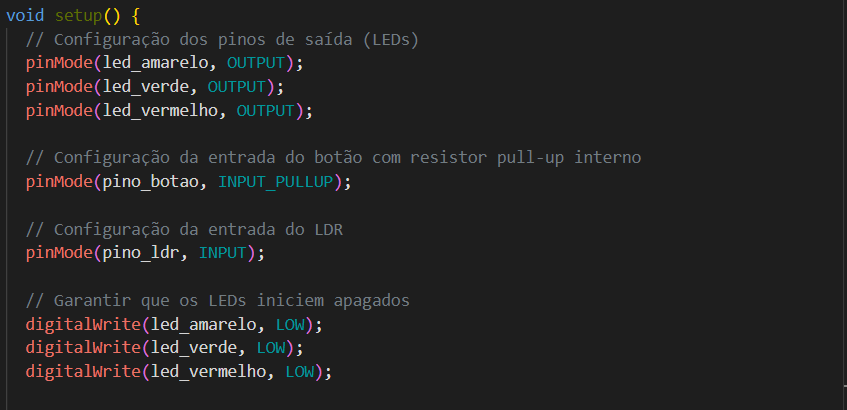
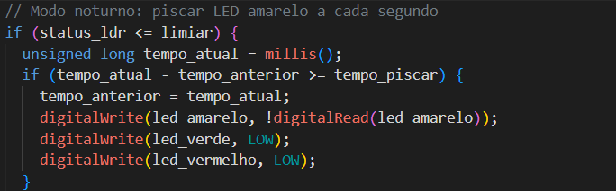
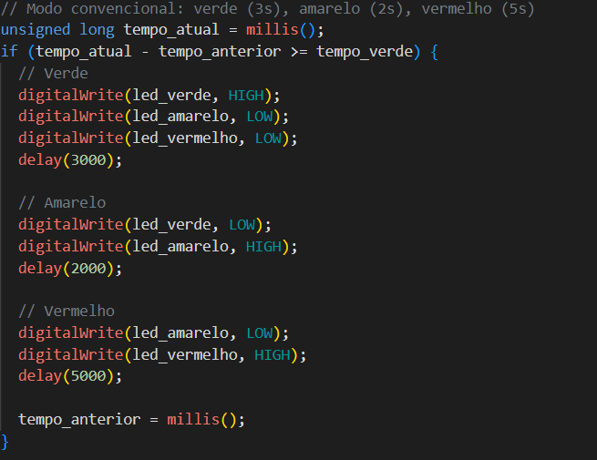
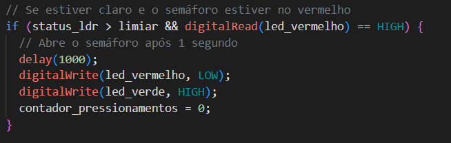
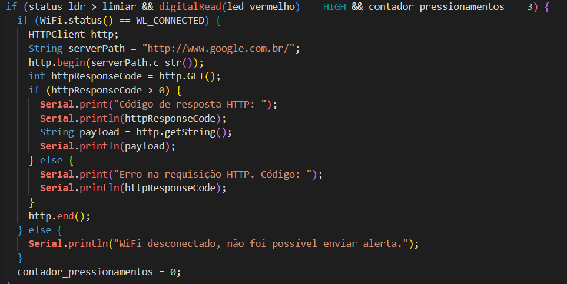

# Projeto de Controle de Semáforo com ESP32

## Estados do Sistema

### 1. Inicialização

- **Descrição**: Todos os LEDs devem estar apagados na inicialização.
- **Screenshot**: 
  

### 2. Modo Noturno (Escuro)

- **Descrição**: Quando estiver escuro (segundo a leitura analógica do sensor LDR), o protótipo deve ativar o modo noturno e piscar o LED amarelo a cada segundo.
- **Screenshot**: 
  

### 3. Modo Convencional (Claro)

- **Descrição**: Quando estiver claro (segundo a leitura analógica do sensor LDR), o protótipo deve ativar o modo convencional e fazer a temporização alternando entre verde (3 segundos), amarelo (2 segundos) e vermelho (5 segundos).
- **Screenshot**: 
  

### 4. Abrir Semáforo com Botão (Claro)

- **Descrição**: Quando estiver claro e o semáforo estiver no estado fechado (somente LED vermelho aceso) e o botão for pressionado, o semáforo deve abrir 1 segundo após o pressionamento do botão.
- **Screenshot**: 
  

### 5. Enviar Requisição HTTP com Pressionamento Triplo

- **Descrição**: Quando estiver claro e o semáforo estiver no estado fechado (somente LED vermelho aceso) e o botão for pressionado 3 vezes, uma requisição HTTP deve ser enviada como alerta
- **Screenshot**: 
  

